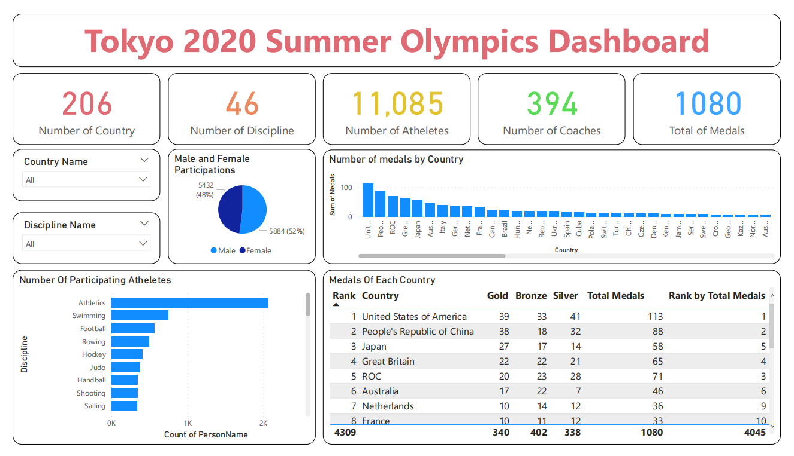

  

  

    <ul>
      
<h1 style="display: inline-block;">🥇🥈🥉Tokyo 2020 Summer Olympic data engineering project</h1>

    </ul>
  

  
  
Create Data Pipeline with Python, MS SQL Server, PowerBI.

 

## Directory file structure
- data/
  - raw/ : This folder contains all raw file dataset.(5 xlxs file)
  - processed/ :  This folder contains all processed file dataset.(5 csv file)
- image/ : This folder contains all image file about data visualization.
- code_log.txt : This is the history processing log file about project.
- requirements.txt : This is all of the necessary library for project.
- SQLQueryScript.sql : This is the sql query script file for project.
- TokyoOlympicsETL.html : This is the html file export from TokyoOlympicsETL.ipynb.
- TokyoOlympicsETL.ipynb: This is the Python Notebook file for ETL process.

## 💻 Create environment for project
1. Set up a virtual environment for Python: 
   - Run command in terminal: python -m venv env
2. Activate the env folder:
   - Run command in terminal: .\env\Scripts\activate
3. Install library for project:
   - Run command in terminal: pip install -r .\requiremets.txt
**NOTE:** To deactivate env folder:
   - Run command in terminal: deactivate

## 🔬 Project Overview 

This an end-to-end data engineering project by Python:
- Data ingestion, transformation by Python.
- Load data and store into MS SQL Server.
- Data analysis by Python.
- Data visualization by MS PowerBI.

Access the link here: [TokyoOlympicsDataAnalysis](TokyoOlympicsDataAnalysis.ipynb)

### 🗃️ Dataset

This contains the details of over 11,000 athletes, with 47 disciplines, along with 743 Teams taking part in the 2021(2020) Tokyo Olympics. This dataset contains the details of the Athletes, Coaches, Teams participating as well as the Entries by gender. It contains their names, countries represented, discipline, gender of competitors, name of the coaches.

- Athletes.xlsx : Contains details about the participating Athletes( Name (name of the athlete) , NOC (Country) , Discipline )
- Coaches.xlsx : Contains details about the Coach(Country, Discipline, Event)
- EntriesGender.xlsx : Contains details about the Coach(Country, Discipline, Event)
- Medals.xlsx : Medals as on 29th July 2021
- Teams.xlsx : Contains the details of all the Teams(Country, event, Discipline, Event)

Access the link here: [2021 Olympics in Tokyo Data](https://www.kaggle.com/datasets/arjunprasadsarkhel/2021-olympics-in-tokyo)

### 🎯 Project Goals
- Create ETL(Extract, Transform, Load) process:
  - Extract all raw data files.
  - Data cleaning and transformation.
  - Loading processed data and storage into database.
- Data analysis by Python.
- Create interactive data visualizations and reports with Microsoft Power BI.

## 💡 Key Insights

- 👨👩 **Male and Female Of Participating**
  - *Male* with 5884(52%) and *Female* with 5432(48%).

- 🏃‍♂️🏃‍♀️ **Number Of Participating Atheletes**
  - *Atheletics* is the top number 1 of Atheletes participate with 2068 followed by *Swimming* with 743 and *Football* with 567.
 
- 🗺️ **Number of medals by country**
  - **Top 1:** United States of America have the most total medals with 113.
  - **Top 2:** People's Republic of China have the most total medals with 88.
  - **Top 3:** ROC have the most total medals with 71.

- 📋 **List of medals of each country** 

### 🛠️ Technologies Used

- **Data Source**: Kaggle website.
- **Extract**: Python(pandas).
- **Transform**: Python(pandas).
- **Load**: Python(pandas, pyodbc), MS SQL Server.
- **Data Visualization**: Python(pandas, matplotlib), MS PowerBI.

## 📨 Contact Me

- Name: Nguyễn Quang Phúc
- Gmail: nguyenquangphuc412@gmail.com